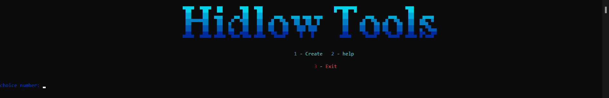
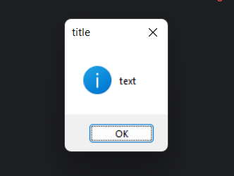
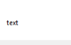

# Windows Notifications
  
**[Russian version](#russian-version) | [English version](#english-version)**

## Russian version
***

**Маленький скрипт для создания уведомлений на ``Python``.  
использует такие библиотеки как ``ctypes``, ``os``, ``time`` и ``threading``**

### Одни из самых важных:
**``ctypes`` - важная библиотека которая создает уведомления:**  

**``threading`` - библиотека которая хорошо дополняет ctypes. Она создает уведомления в 
``отдельном потоке`` для того, чтобы вы могли работать с консолью ``не закрывая уведомление 
и/или создавать больше одного окна``**

****
### Помощь в использовании
**Для того, чтобы создать окно, вам нужно ввести следующие данные: ``title``, ``icon`` и ``text``**  

**``title`` - это заголовок окна**

**``icon`` - это значок уведомления**

**Доступные значки: ``info``, ``error``, ``warning``, ``question``.  
Также вы можете ``не писать значок``, и вместо значка будет пустое поле с текстом**

**``text`` - поле, где будет ваш текст**

### Доп. Команды
**1. ``clear`` - очищает консоль**

**2. ``exit`` - выход**

***
## English version

**A small script for creating notifications in ``Python``.
It uses libraries such as ``ctypes``, ``os``, ``time``, and ``threading``.**

### Some of the most important ones:

**``ctypes`` – the main library that creates the notifications:**

![notify_test.png]assets/(notify_test.png)

**``threading`` – a library that works great together with ctypes.
It creates notifications in a ``separate thread`` so ``you can keep using the console
without closing the notification and/or create more than one window``.**

### Usage Help

**To create a window, you need to enter the following data: ``title``, ``icon``, and ``text``.**

**``title`` – the window’s title**

**``icon`` – the notification icon**

**Available icons: ``info``, ``error``, ``warning``, ``question``.
You can also ``leave out the icon``, and the window will show an empty field with text instead.**

**``text`` – the field where your message will be displayed**

### Extra Commands

**1. ``clear`` – clears the console**

**2. ``exit`` – exit**
